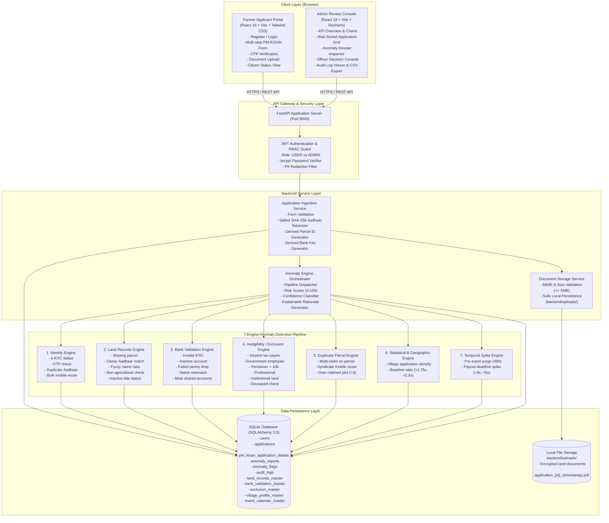
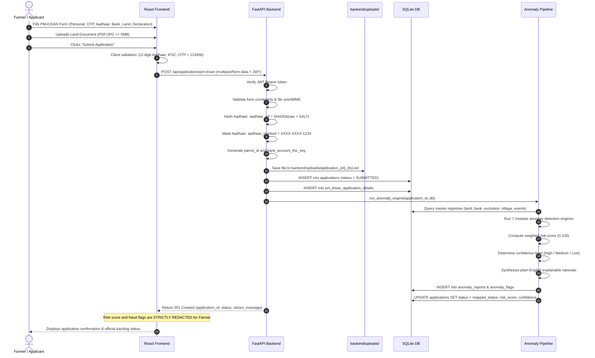
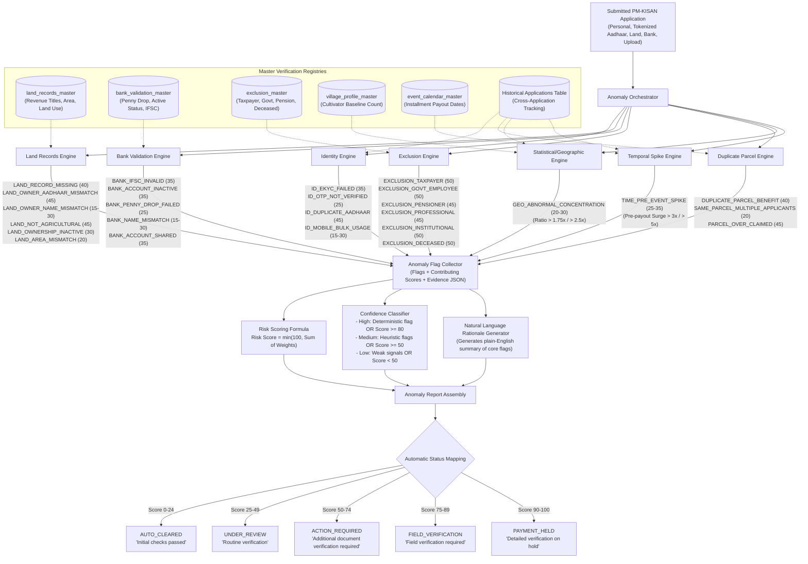
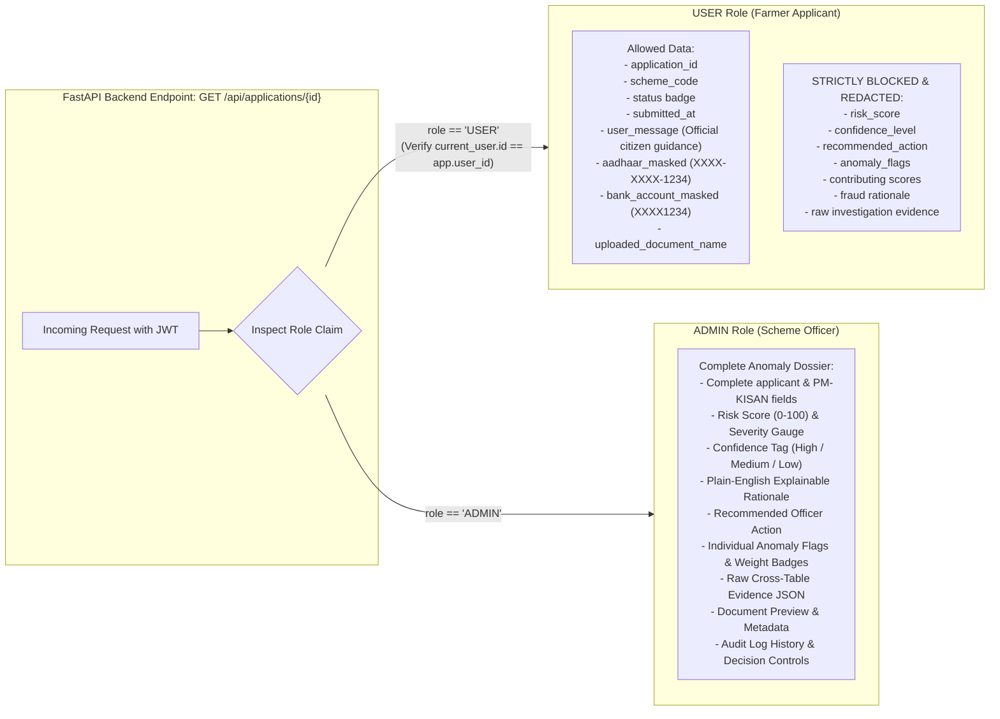
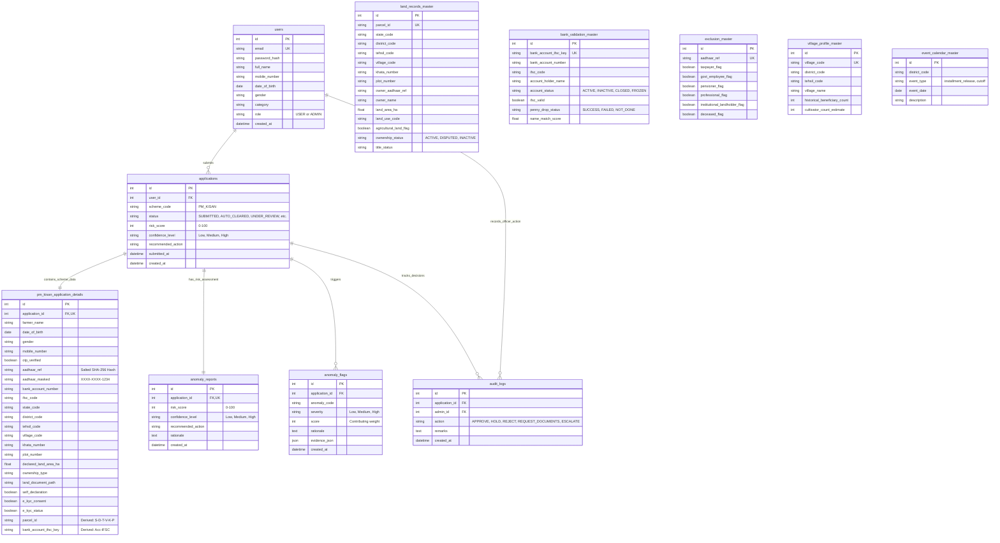
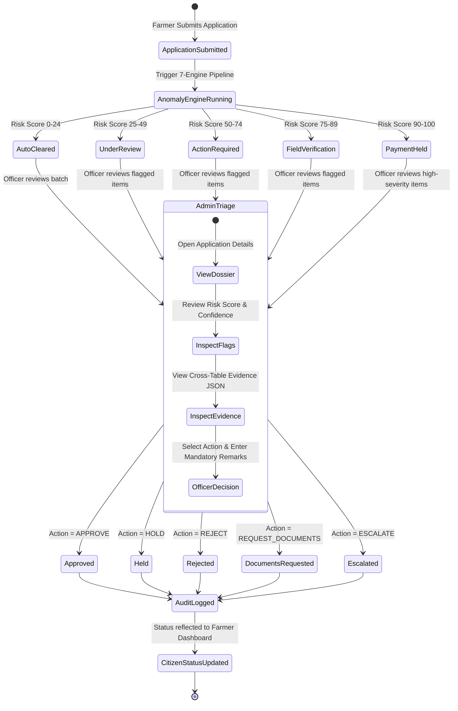

# KisanGuard Portal — Full Architecture Diagram & System Design

**Project**: KisanGuard Portal  
**Domain**: PM-KISAN Scheme Application & AI-Driven Anomaly Detection System  
**Hackathon**: HackSpora 2.0 (Problem Statement 3: AI Driven Fraud and Anomaly Detection)  

---

## 1. High-Level System Topology



---

## 2. End-to-End Application Ingestion & Scoring Flow



---

## 3. Modular Anomaly Pipeline & Risk Scoring Flow



---

## 4. Privacy Boundary & Role-Based Response Isolation



---

## 5. Database Entity-Relationship Diagram



---

## 6. Admin Triage & Adjudication Lifecycle



---

## 7. Repository Layout & Component Mapping

```text
hackspora/
│
├── .planning/                          # GSD Planning & Architecture Artifacts
│   ├── PROJECT.md                      # Core values, scope, constraints
│   ├── REQUIREMENTS.md                 # 34 checkable atomic v1 requirements
│   ├── ROADMAP.md                      # 7-phase vertical MVP roadmap
│   ├── STATE.md                        # Living phase progress tracking
│   ├── config.json                     # GSD workflow configuration
│   └── research/                       # Stack, features, architecture, pitfalls
│
├── backend/                            # FastAPI Python Backend
│   ├── app/
│   │   ├── main.py                     # App entry point, CORS, routers
│   │   ├── config.py                   # Environment & security config (SECRET_KEY, SALT)
│   │   ├── database.py                 # SQLite SQLAlchemy engine & session factory
│   │   ├── models.py                   # SQLAlchemy ORM models (11 tables)
│   │   ├── schemas.py                  # Pydantic validation & response schemas
│   │   ├── auth.py                     # JWT token encode/decode, bcrypt, get_current_user
│   │   ├── routes/
│   │   │   ├── auth_routes.py          # /api/auth (register, login, me)
│   │   │   ├── user_routes.py          # /api/applications (submit, list my, get detail)
│   │   │   ├── scheme_routes.py        # /api/schemes (PM-KISAN field metadata)
│   │   │   └── admin_routes.py         # /api/admin (summary, filter, dossier, decision, CSV)
│   │   ├── services/
│   │   │   ├── application_service.py  # File storage, Aadhaar tokenizer, key generator
│   │   │   ├── anomaly_engine.py       # Orchestrator running all 7 engines
│   │   │   ├── identity_engine.py      # Engine 1: e-KYC, OTP, duplicate Aadhaar, mobile
│   │   │   ├── land_engine.py          # Engine 2: Parcel existence, owner Aadhaar, fuzzy name
│   │   │   ├── bank_engine.py          # Engine 3: IFSC, inactive account, penny-drop, shared
│   │   │   ├── exclusion_engine.py     # Engine 4: Taxpayer, govt, pension, deceased checks
│   │   │   ├── duplicate_engine.py     # Engine 5: Multi-claim parcel, syndicate detection
│   │   │   ├── statistical_engine.py   # Engine 6: Geographic village density baseline
│   │   │   ├── temporal_engine.py      # Engine 7: Pre-event deadline submission spikes
│   │   │   ├── risk_scorer.py          # Weighted scoring formula (0-100) & confidence
│   │   │   └── rationale_generator.py  # Plain-English explanation synthesizer
│   │   └── seed/
│   │       └── seed_data.py            # Master registries & 20 sample applications
│   ├── uploads/                        # Local file storage for land documents
│   └── requirements.txt                # Python dependencies
│
├── frontend/                           # React 18 + Vite Frontend
│   ├── src/
│   │   ├── api/                        # Axios instance & API service functions
│   │   ├── components/                 # Reusable UI (Navbar, Badges, Modals, Charts)
│   │   ├── context/                    # AuthContext (JWT, user state, login/logout)
│   │   ├── pages/
│   │   │   ├── Login.jsx               # Citizen & Officer Login
│   │   │   ├── Register.jsx            # Farmer Registration
│   │   │   ├── FarmerDashboard.jsx     # Citizen application list & status cards
│   │   │   ├── ApplyPMKisan.jsx        # Multi-section wizard with OTP & upload
│   │   │   ├── ApplicationDetail.jsx   # Citizen application tracker (redacted fraud)
│   │   │   ├── AdminDashboard.jsx      # KPI metrics, Recharts, filterable grid
│   │   │   └── AdminDossier.jsx        # Deep anomaly inspection & decision modal
│   │   ├── App.jsx                     # Route definitions & Role guards
│   │   └── main.jsx
│   ├── package.json
│   └── tailwind.config.js
│
├── ARCHITECTURE_DIAGRAM.md             # This comprehensive architecture diagram document
├── context.md                          # Original hackathon problem context & blueprint
├── AGENTS.md                           # Developer & AI Agent workflow instructions
└── GEMINI.md                           # Antigravity/Gemini runtime directives
```
