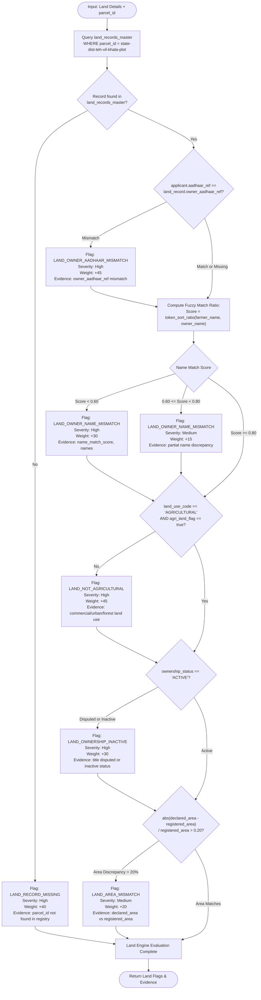
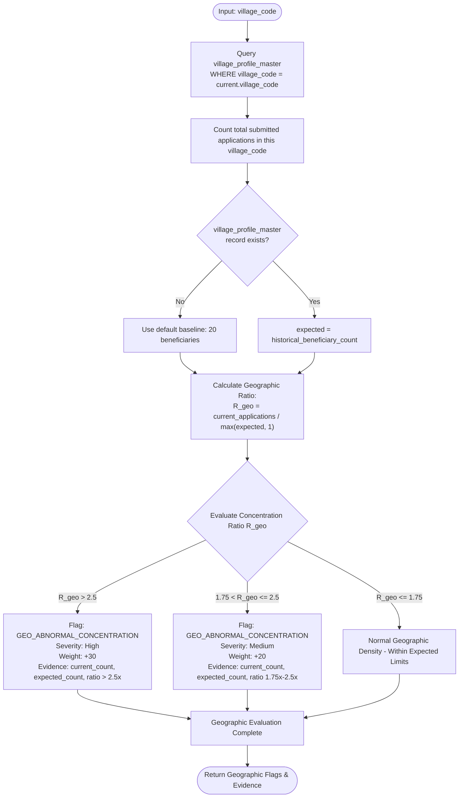
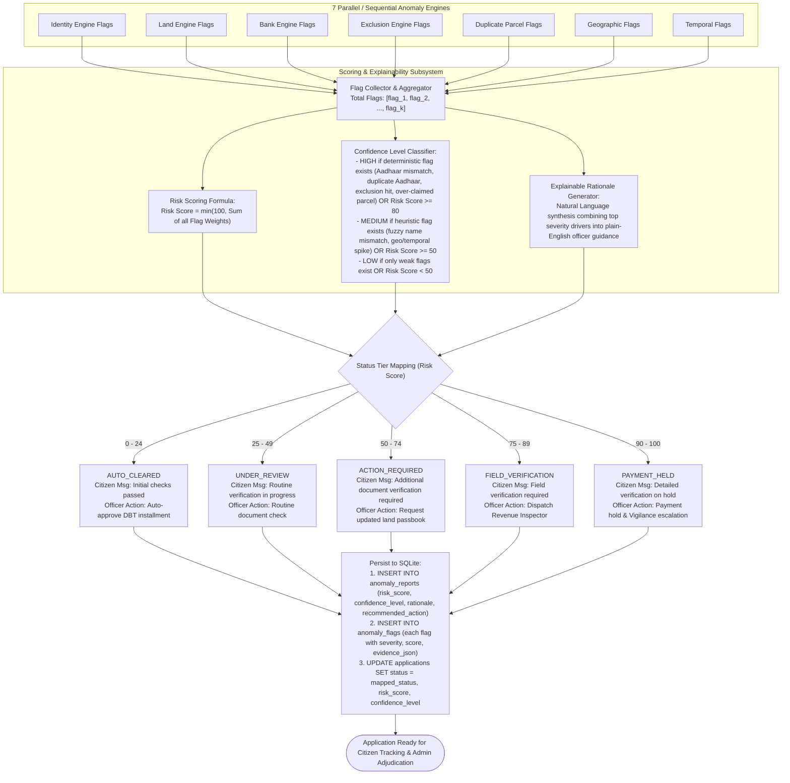

# KisanGuard Portal — Anomaly Detection Engines Workflow Reference

This document provides complete flowchart diagrams, decision logic, input sources, anomaly codes, severity weights, and evidence schemas for each of the 7 anomaly detection engines in KisanGuard Portal.

---

## Engine 1: Identity & e-KYC Verification Engine


---

## Engine 2: Land Records Verification Engine



---

## Engine 3: Bank Account & DBT Validation Engine

```mermaid
flowchart TD
    Start(["Input: bank_account_number + ifsc_code"]) --> BuildKey["Derive bank_account_ifsc_key\n= account_number + '-' + ifsc_code"]

    BuildKey --> ValidateIFSCFormat{"Regex match IFSC:\n^[A-Z]{4}0[A-Z0-9]{6}$"}

    ValidateIFSCFormat -->|Invalid Format| FlagIFSC["Flag: BANK_IFSC_INVALID\nSeverity: High\nWeight: +35\nEvidence: invalid RBI IFSC format"]
    ValidateIFSCFormat -->|Valid Format| QueryBankMaster["Query bank_validation_master\nWHERE bank_account_ifsc_key = key"]

    FlagIFSC --> QueryBankMaster

    QueryBankMaster --> BankRecordFound{"Record found in\nbank_validation_master?"}

    BankRecordFound -->|No| FlagMissingBank["Flag: BANK_VALIDATION_MISSING\nSeverity: Low\nWeight: +10\nEvidence: unverified bank master record"]
    BankRecordFound -->|Yes| CheckAccStatus{"account_status == 'ACTIVE'?"}

    CheckAccStatus -->|Inactive or Closed or Frozen| FlagAccInactive["Flag: BANK_ACCOUNT_INACTIVE\nSeverity: High\nWeight: +35\nEvidence: account_status"]
    CheckAccStatus -->|Active| CheckPennyDrop{"penny_drop_status == 'SUCCESS'?"}

    FlagAccInactive --> CheckPennyDrop

    CheckPennyDrop -->|Failed| FlagPennyFailed["Flag: BANK_PENNY_DROP_FAILED\nSeverity: Medium\nWeight: +25\nEvidence: NPCI penny-drop rejected"]
    CheckPennyDrop -->|Success or Not Done| FuzzyBankName["Compute Fuzzy Ratio:\nScore = token_sort_ratio(farmer_name, holder_name)"]

    FlagPennyFailed --> FuzzyBankName

    FuzzyBankName --> EvalBankName{"Name Match Score"}
    EvalBankName -->|Score < 0.60| FlagBankNameHigh["Flag: BANK_NAME_MISMATCH\nSeverity: High\nWeight: +30\nEvidence: bank_name_score, holder_name"]
    EvalBankName -->|0.60 <= Score < 0.80| FlagBankNameMed["Flag: BANK_NAME_MISMATCH\nSeverity: Medium\nWeight: +15\nEvidence: partial name discrepancy"]
    EvalBankName -->|Score >= 0.80| CheckSharedAccount["Count applications with same\nbank_account_ifsc_key"]

    FlagBankNameHigh --> CheckSharedAccount
    FlagBankNameMed --> CheckSharedAccount

    CheckSharedAccount --> SharedCount{"Linked applications count > 1?"}

    SharedCount -->|Yes (Count > 1)| FlagShared["Flag: BANK_ACCOUNT_SHARED\nSeverity: High\nWeight: +35\nEvidence: mule account alert, linked_app_ids"]
    SharedCount -->|No (Count == 1)| BankPass["Bank Engine Evaluation Complete"]

    FlagMissingBank --> CheckSharedAccount
    FlagShared --> BankPass
    BankPass --> OutputFlags(["Return Bank Flags & Evidence"])
```

---

## Engine 4: Ineligibility & Exclusion Categories Engine

```mermaid
flowchart TD
    Start(["Input: applicant.aadhaar_ref"]) --> QueryExclusion["Query exclusion_master\nWHERE aadhaar_ref = applicant.aadhaar_ref"]

    QueryExclusion --> RecordFound{"Record exists in\nexclusion_master?"}

    RecordFound -->|No Record Found| ExclusionPass["Applicant clear of all statutory exclusions"]

    RecordFound -->|Record Found| CheckTaxpayer{"taxpayer_flag == true?\n(Paid Income Tax in Assessment Year)"}

    CheckTaxpayer -->|Yes| FlagTax["Flag: EXCLUSION_TAXPAYER\nSeverity: High\nWeight: +50\nEvidence: IT Department cross-match"]
    CheckTaxpayer -->|No| CheckGovtEmp{"govt_employee_flag == true?\n(State/Central Govt Employee)"}

    FlagTax --> CheckGovtEmp

    CheckGovtEmp -->|Yes| FlagGovt["Flag: EXCLUSION_GOVT_EMPLOYEE\nSeverity: High\nWeight: +50\nEvidence: Government service registry hit"]
    CheckGovtEmp -->|No| CheckPensioner{"pensioner_flag == true?\n(Pension > Rs 10,000 / month)"}

    FlagGovt --> CheckPensioner

    CheckPensioner -->|Yes| FlagPension["Flag: EXCLUSION_PENSIONER\nSeverity: High\nWeight: +45\nEvidence: Treasury pension records"]
    CheckPensioner -->|No| CheckProfessional{"professional_flag == true?\n(Doctor, Lawyer, Engineer, CA, Architect)"}

    FlagPension --> CheckProfessional

    CheckProfessional -->|Yes| FlagProf["Flag: EXCLUSION_PROFESSIONAL\nSeverity: High\nWeight: +45\nEvidence: Professional council member registry"]
    CheckProfessional -->|No| CheckInst{"institutional_landholder_flag == true?\n(Institutional / Trust Land)"}

    FlagProf --> CheckInst

    CheckInst -->|Yes| FlagInst["Flag: EXCLUSION_INSTITUTIONAL\nSeverity: High\nWeight: +50\nEvidence: Institutional land holding"]
    CheckInst -->|No| CheckDeceased{"deceased_flag == true?\n(Applicant on Civil Death Register)"}

    FlagInst --> CheckDeceased

    CheckDeceased -->|Yes| FlagDeceased["Flag: EXCLUSION_DECEASED\nSeverity: High\nWeight: +50\nEvidence: Registrar of births and deaths"]
    CheckDeceased -->|No| DoneExclusion["Exclusion Evaluation Complete"]

    FlagDeceased --> DoneExclusion
    ExclusionPass --> DoneExclusion
    DoneExclusion --> OutputFlags(["Return Exclusion Flags & Evidence"])
```



---

## Engine 5: Duplicate Land Parcel & Syndicate Engine

```mermaid
flowchart TD
    Start(["Input: parcel_id + applicant_id + mobile_number"]) --> QueryParcelApps["Query all submitted applications\nWHERE parcel_id = current.parcel_id\nAND id != current.id"]

    QueryParcelApps --> ParcelAppCount{"How many other applications\nclaim this exact parcel_id?"}

    ParcelAppCount -->|0 Other Applications| NoDuplicate["Single claim on parcel - Normal"]

    ParcelAppCount -->|1 or more Other Applications| CheckSameMobile{"Any other application uses\nidentical mobile_number?"}

    CheckSameMobile -->|Yes (Same mobile)| FlagDupBenefit["Flag: DUPLICATE_PARCEL_BENEFIT\nSeverity: High\nWeight: +40\nEvidence: syndicate fraud; same parcel and mobile"]
    CheckSameMobile -->|No (Distinct mobiles)| EvalTotalClaimants{"Total distinct claimants on parcel"}

    FlagDupBenefit --> EvalTotalClaimants

    EvalTotalClaimants -->|Total <= 3 claimants| FlagMultiple["Flag: SAME_PARCEL_MULTIPLE_APPLICANTS\nSeverity: Medium\nWeight: +20\nEvidence: parcel claimed by 2-3 applicants"]
    EvalTotalClaimants -->|Total > 3 claimants| FlagOverClaimed["Flag: PARCEL_OVER_CLAIMED\nSeverity: High\nWeight: +45\nEvidence: parcel over-claimed by > 3 applicants"]

    NoDuplicate --> DuplicateDone["Duplicate Parcel Evaluation Complete"]
    FlagMultiple --> DuplicateDone
    FlagOverClaimed --> DuplicateDone
    DuplicateDone --> OutputFlags(["Return Duplicate Parcel Flags & Evidence"])
```

---

## Engine 6: Statistical & Geographic Concentration Engine



---

## Engine 7: Temporal Spike & Pre-Event Surge Engine


---

## 8. Master Synthesis: Risk Scorer, Confidence & Rationale Orchestration


