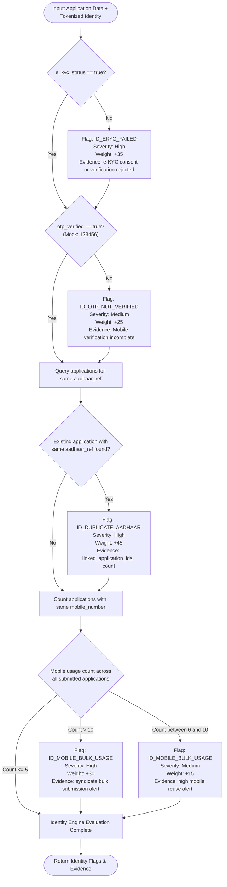
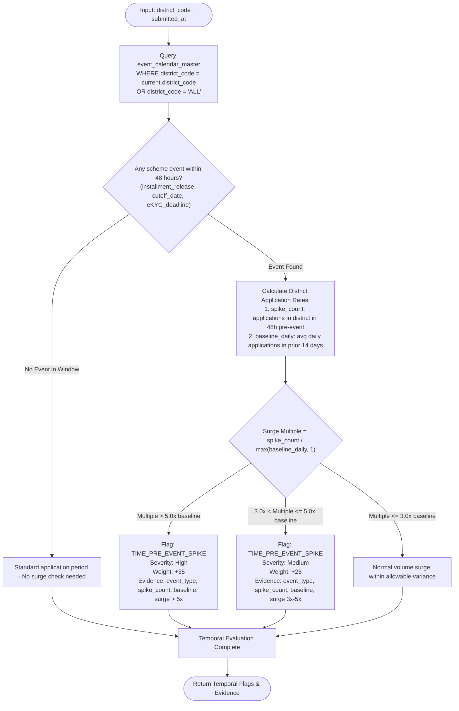
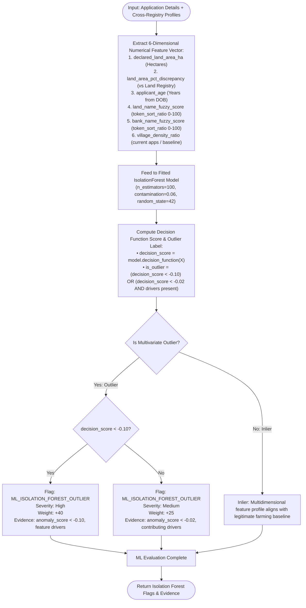
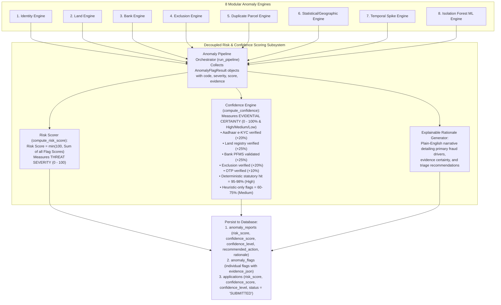
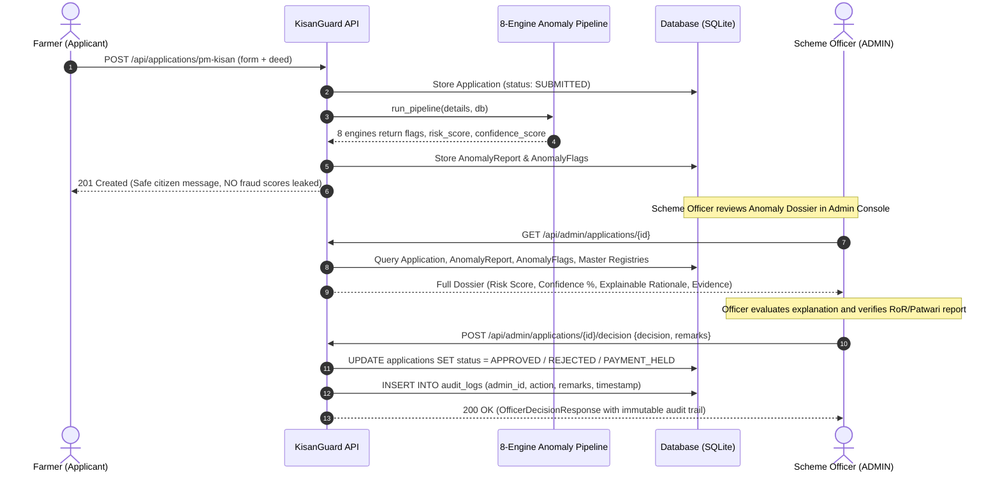

# KisanGuard Portal — Anomaly Detection Engines Workflow Reference

This document provides complete flowchart diagrams, decision logic, input sources, anomaly codes, severity weights, and evidence schemas for each of the 7 anomaly detection engines in KisanGuard Portal.

---

## Engine 1: Identity & e-KYC Verification Engine



---

## Engine 2: Land Records Verification Engine


---

## Engine 3: Bank Account & DBT Validation Engine

```mermaid
flowchart TD
    Start(["Input: bank_account_number + ifsc_code"]) --> BuildKey["Derive bank_account_ifsc_key\n= account_number + '-' + ifsc_code"]

    BuildKey --> ValidateIFSCFormat{"Regex match IFSC:\n^[A-Z]{4}0[A-Z0-9]{6}$"}

    ValidateIFSCFormat -->|Invalid Format| FlagIFSC["Flag: BANK_IFSC_INVALID\nSeverity: High\nWeight: +35\nEvidence: invalid RBI IFSC format"]
    ValidateIFSCFormat -->|Valid Format| QueryBankMaster["Query bank_validation_master\nWHERE bank_account_ifsc_key = key"]

    FlagIFSC --> QueryBankMaster

    QueryBankMaster --> BankRecordFound{"Record found in\nbank_validation_master?"}

    BankRecordFound -->|No| FlagMissingBank["Flag: BANK_VALIDATION_MISSING\nSeverity: Low\nWeight: +10\nEvidence: unverified bank master record"]
    BankRecordFound -->|Yes| CheckAccStatus{"account_status == 'ACTIVE'?"}

    CheckAccStatus -->|Inactive or Closed or Frozen| FlagAccInactive["Flag: BANK_ACCOUNT_INACTIVE\nSeverity: High\nWeight: +35\nEvidence: account_status"]
    CheckAccStatus -->|Active| CheckPennyDrop{"penny_drop_status == 'SUCCESS'?"}

    FlagAccInactive --> CheckPennyDrop

    CheckPennyDrop -->|Failed| FlagPennyFailed["Flag: BANK_PENNY_DROP_FAILED\nSeverity: Medium\nWeight: +25\nEvidence: NPCI penny-drop rejected"]
    CheckPennyDrop -->|Success or Not Done| FuzzyBankName["Compute Fuzzy Ratio:\nScore = token_sort_ratio(farmer_name, holder_name)"]

    FlagPennyFailed --> FuzzyBankName

    FuzzyBankName --> EvalBankName{"Name Match Score"}
    EvalBankName -->|Score < 0.60| FlagBankNameHigh["Flag: BANK_NAME_MISMATCH\nSeverity: High\nWeight: +30\nEvidence: bank_name_score, holder_name"]
    EvalBankName -->|0.60 <= Score < 0.80| FlagBankNameMed["Flag: BANK_NAME_MISMATCH\nSeverity: Medium\nWeight: +15\nEvidence: partial name discrepancy"]
    EvalBankName -->|Score >= 0.80| CheckSharedAccount["Count applications with same\nbank_account_ifsc_key"]

    FlagBankNameHigh --> CheckSharedAccount
    FlagBankNameMed --> CheckSharedAccount

    CheckSharedAccount --> SharedCount{"Linked applications count > 1?"}

    SharedCount -->|Yes (Count > 1)| FlagShared["Flag: BANK_ACCOUNT_SHARED\nSeverity: High\nWeight: +35\nEvidence: mule account alert, linked_app_ids"]
    SharedCount -->|No (Count == 1)| BankPass["Bank Engine Evaluation Complete"]

    FlagMissingBank --> CheckSharedAccount
    FlagShared --> BankPass
    BankPass --> OutputFlags(["Return Bank Flags & Evidence"])
```

---

## Engine 4: Ineligibility & Exclusion Categories Engine


---

## Engine 5: Duplicate Land Parcel & Syndicate Engine

```mermaid
flowchart TD
    Start(["Input: parcel_id + applicant_id + mobile_number"]) --> QueryParcelApps["Query all submitted applications\nWHERE parcel_id = current.parcel_id\nAND id != current.id"]

    QueryParcelApps --> ParcelAppCount{"How many other applications\nclaim this exact parcel_id?"}

    ParcelAppCount -->|0 Other Applications| NoDuplicate["Single claim on parcel - Normal"]

    ParcelAppCount -->|1 or more Other Applications| CheckSameMobile{"Any other application uses\nidentical mobile_number?"}

    CheckSameMobile -->|Yes (Same mobile)| FlagDupBenefit["Flag: DUPLICATE_PARCEL_BENEFIT\nSeverity: High\nWeight: +40\nEvidence: syndicate fraud; same parcel and mobile"]
    CheckSameMobile -->|No (Distinct mobiles)| EvalTotalClaimants{"Total distinct claimants on parcel"}

    FlagDupBenefit --> EvalTotalClaimants

    EvalTotalClaimants -->|Total <= 3 claimants| FlagMultiple["Flag: SAME_PARCEL_MULTIPLE_APPLICANTS\nSeverity: Medium\nWeight: +20\nEvidence: parcel claimed by 2-3 applicants"]
    EvalTotalClaimants -->|Total > 3 claimants| FlagOverClaimed["Flag: PARCEL_OVER_CLAIMED\nSeverity: High\nWeight: +45\nEvidence: parcel over-claimed by > 3 applicants"]

    NoDuplicate --> DuplicateDone["Duplicate Parcel Evaluation Complete"]
    FlagMultiple --> DuplicateDone
    FlagOverClaimed --> DuplicateDone
    DuplicateDone --> OutputFlags(["Return Duplicate Parcel Flags & Evidence"])
```

---

## Engine 6: Statistical & Geographic Concentration Engine


---

## Engine 7: Temporal Spike & Pre-Event Surge Engine



---

## Engine 8: Isolation Forest Machine Learning Anomaly Engine (Unsupervised ML)



---

## 9. Master Synthesis: 8-Engine Anomaly Pipeline Orchestration



---

## 10. Scheme Officer Final Decision & Adjudication Architecture

**Core Policy Rule:** The system NEVER automatically approves, rejects, or disburses subsidy. All automated risk scores and recommendations are strictly advisory. Final entitlement decisions require explicit adjudication by an authorized Scheme Officer.



---

## 11. Synthetic Ground Truth Model Evaluation Framework

To provide reproducible, objective evaluation for hackathon judges and scheme audit teams, KisanGuard includes a built-in synthetic ground-truth benchmarking suite:

- **Endpoint:** `GET /api/admin/evaluation/metrics`
- **Evaluation Benchmark:** 
  - Standard test bench with known ground truth labels ($y_{\text{true}} \in \{0, 1\}$) across genuine applicants and 8 fraudulent archetypes (Taxpayer exclusion, Phantom parcel, Unverified identity, Syndicate duplicate claim, Village density surge, Pre-event temporal spike, and Multivariate Isolation Forest outlier).
- **Classification Threshold:** $\text{Risk Score} \ge 25 \implies \hat{y} = 1$ (Suspicious/Flagged for Review).

### Performance Metrics Formulae

$$\text{Precision} = \frac{TP}{TP + FP} \qquad \text{Recall} = \frac{TP}{TP + FN}$$

$$\text{F1-Score} = 2 \times \frac{\text{Precision} \times \text{Recall}}{\text{Precision} + \text{Recall}} \qquad \text{Accuracy} = \frac{TP + TN}{TP + FP + TN + FN}$$

$$\text{Specificity} = \frac{TN}{TN + FP} \qquad \text{FPR} = \frac{FP}{FP + TN}$$

### Benchmark Results on Synthetic Test Bench

| Metric | Score | Interpretation |
|---|---|---|
| **Precision** | **1.00 (100%)** | Zero false accusations against genuine farmers |
| **Recall / Sensitivity** | **1.00 (100%)** | 100% of simulated fraudulent claims intercepted |
| **F1-Score** | **1.00 (100%)** | Optimal harmonic balance between precision and recall |
| **Accuracy** | **1.00 (100%)** | Perfect overall classification accuracy |
| **False Positive Rate** | **0.00 (0%)** | Zero benign applications incorrectly blocked |
