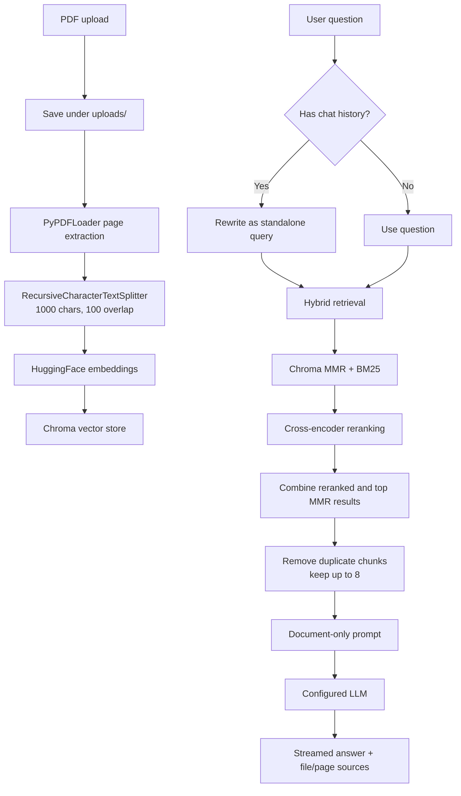

# PDF RAG Chatbot

## Overview

PDF RAG Chatbot is a Streamlit application for asking questions about uploaded PDF documents. It uses Retrieval-Augmented Generation (RAG): relevant text is retrieved from the uploaded documents and supplied to a language model before an answer is generated.

The application prompt instructs the model to use only the retrieved context. When the documents do not contain enough information, the expected response is `I don't know based on the provided documents.` The chatbot is therefore intended to answer from the indexed PDFs, not to act as a general-purpose source of the model's outside knowledge.

## Features

- Upload PDF files through the Streamlit sidebar.
- Extract PDF pages with `PyPDFLoader`.
- Split pages into 1,000-character chunks with 100-character overlap.
- Generate embeddings with `sentence-transformers/all-MiniLM-L6-v2`.
- Store chunks and metadata in ChromaDB.
- Combine semantic MMR retrieval with BM25 lexical retrieval.
- Rerank candidates with `cross-encoder/ms-marco-MiniLM-L-6-v2`.
- Rewrite follow-up questions using conversation history.
- Stream document-grounded answers through the configured LLM.
- Display source filenames and one-based page references.
- Add, delete, rebuild, and clear the local document index from the UI.
- Run saved-answer generation and RAGAS-based evaluation scripts.
- Support Ollama for the separate local evaluation path and experimental local LLM configuration.

## RAG Architecture



When a new PDF is uploaded, its chunks are added to the local Chroma store. The **Rebuild Database** action reloads all PDFs in `uploads/`, recreates the collection, and reindexes them.

## Retrieval System

The active retriever in `retriever/hybrid_retriever.py` is an ensemble of:

| Retriever | Configuration |
| --- | --- |
| Chroma semantic retriever | MMR, `k=10`, `fetch_k=40`, `lambda_mult=0.75` |
| BM25 lexical retriever | `k=8`, built from the freshly loaded and split PDFs |
| Ensemble weights | Semantic `0.6`, BM25 `0.4` |

The combined candidates are scored by `cross-encoder/ms-marco-MiniLM-L-6-v2`. In the application query path, reranking requests `top_k=4` with the default score threshold of `-1.0`. The result is combined with the first four MMR candidates, duplicate chunk text is removed, and up to eight chunks are sent to the LLM. The reranker first prefers one selected chunk per page to preserve page diversity, then fills remaining slots by score.

The separate `retriever/retriever.py` module defines an MMR retriever with `k=5` and `fetch_k=25`; it is not used by the Streamlit application.

## LLM

The active application LLM is `ChatGroq` from `langchain-groq`, configured in `llm/llm.py` with:

- Model: `openai/gpt-oss-20b`
- Temperature: `0`
- Credential: `GROQ_API_KEY`

`llm/gemini.py` contains an alternative `ChatGoogleGenerativeAI` loader using `GOOGLE_API_KEY`, but it is not imported by the active application. An Ollama `ChatOllama` configuration for `qwen3.5:9b` is present as commented code in `llm/llm.py`.

## Vector Database

Chroma is used as the persistent vector database through `langchain-chroma`. Each split document is stored with its page metadata and a generated `chunk_id`. The configured collection name is `rag_documents`, and the persistence directory is `chroma_db`.

The application also maintains a BM25 index in memory from the PDFs in `uploads/` when the hybrid retriever is loaded. Chroma provides the persistent semantic index; BM25 is rebuilt from the current upload directory.

The collection name is explicitly set to `rag_documents` when a store is created, but the current load and delete helpers do not pass that name consistently. This is a current implementation caveat to review when moving beyond local development.

## Evaluation

The evaluation dataset in `evaluation/test_questions.py` contains eight answerable and two unanswerable questions. The checked-in `evaluation/evaluation_results.json` contains generated answers, references, and retrieved contexts for those questions; it does not contain aggregate metric scores.

The RAGAS script in `evaluation/ragas_evaluation.py` calculates:

- Context Precision
- Context Recall
- Faithfulness
- Answer Relevance
- Answer Correctness
- Abstention Accuracy

The custom evaluator in `evaluation/evaluator.py` also defines retrieval metrics (`Recall@12`, `Precision@4`, and reciprocal rank/MRR), binary context relevance, binary faithfulness, binary answer relevance, and abstention evaluation. Its current runner expects `expected_files` fields that are not present in the current `test_questions.py` entries, so that script may require dataset alignment before it can run successfully.

No aggregate benchmark scores are claimed here because they are not stored in the current repository artifacts. Any scores printed by a future evaluation run should be labeled as development-set results, not production benchmarks.

## Ollama Support

Ollama is used by the RAGAS evaluation path through its OpenAI-compatible endpoint at `http://localhost:11434/v1`. The RAGAS script uses `qwen2.5:3b` as its evaluation LLM and configures the same MiniLM embedding model on CUDA. The standalone smoke test and `Modelfile` reference `qwen3.5:9b`; this model is not the active application LLM.

Ollama models are installed separately and are not included in `requirements.txt`.

## Project Structure

```text
.
├── app.py                         # Streamlit UI and chat workflow
├── config.py                      # Model, Chroma path, and collection settings
├── index.py                       # PDF indexing and full database rebuild
├── Modelfile                      # Ollama qwen3.5:9b model parameters
├── requirements.txt               # Python dependencies
├── test_ollama.py                 # Ollama/Groq provider smoke test code
├── test_ragas_ollama.py           # RAGAS plus Ollama initialization check
├── embeddings/
│   └── embedding_model.py         # Hugging Face embedding loader
├── evaluation/
│   ├── evaluator.py                # Custom retrieval/generation metrics
│   ├── evaluation_results.json     # Saved answers and retrieved contexts
│   ├── ragas_evaluation.py         # RAGAS evaluation from saved results
│   ├── run_evaluation.py           # Custom evaluation runner
│   ├── run_rag_test.py             # Generate saved RAG outputs
│   └── test_questions.py           # Evaluation questions and references
├── llm/
│   ├── llm.py                      # Active Groq LLM loader
│   └── gemini.py                   # Alternative Gemini loader
├── loaders/
│   └── pdf_loader.py               # PDF page loading
├── preprocess/
│   └── splitter.py                 # Text chunking and chunk metadata
├── prompts/                        # Currently empty
├── rag/
│   └── rag_chain.py                # Query rewriting, prompting, and streaming
├── retriever/
│   ├── hybrid_retriever.py         # Chroma MMR and BM25 ensemble
│   ├── reranker.py                 # Cross-encoder reranking and deduplication
│   └── retriever.py                # Alternate standalone MMR retriever
├── utils/
│   ├── file_manager.py             # Uploaded PDF management
│   ├── greetings.py                # Local greeting handling
│   └── source_utils.py             # Source extraction and grouping
└── vectordb/
    ├── chroma_db.py                # Chroma load/create/add operations
    └── delete_documents.py         # Delete chunks belonging to a PDF
```

Runtime directories `uploads/` and `chroma_db/` are created or used locally and are ignored by Git. The current application uses those paths directly; the `CHROMA_DB` and `DATA_FOLDER` variables in `.env.example` are not currently read by the source code.

## Installation

These commands are suitable for Windows PowerShell:

```powershell
git clone https://github.com/Jayasurya-C-0609/Rag_Chatbot.git
cd Rag_Chatbot

python -m venv .venv
.\.venv\Scripts\Activate.ps1
pip install -r requirements.txt

Copy-Item .env.example .env
```

Edit `.env` and set the required provider credential:

```dotenv
GROQ_API_KEY=your_groq_api_key
```

`GOOGLE_API_KEY` is used only by the alternative Gemini loader. `CHROMA_DB` and `DATA_FOLDER` are present as configuration examples but are currently unused; the application uses `chroma_db` and `uploads` relative to the working directory.

The first run may download the embedding and cross-encoder models from Hugging Face. Add PDFs through the application after setup.

## Ollama Setup

Install Ollama separately from [ollama.com](https://ollama.com), then start its local service. Pull the models used by the repository as needed:

```powershell
ollama pull qwen2.5:3b
ollama pull qwen3.5:9b
ollama list
```

Verify the service is responding:

```powershell
Invoke-RestMethod http://localhost:11434/api/tags
```

The active Streamlit application uses Groq, not Ollama. Ollama is currently used by `evaluation/ragas_evaluation.py`; that script expects the local endpoint and the `qwen2.5:3b` model. The `qwen3.5:9b` model is referenced by `test_ragas_ollama.py`, `test_ollama.py`, and `Modelfile`.

## Running the Application

From the repository root with the virtual environment activated:

```powershell
streamlit run app.py
```

Use the sidebar to upload PDFs, inspect uploaded files, delete documents, rebuild the index, or clear the local Chroma directory. Ask questions in the chat area to receive a streamed answer and extracted file/page sources.

## Evaluation Commands

Generate answers and retrieved contexts for the configured dataset:

```powershell
python evaluation/run_rag_test.py
```

Run the custom evaluator:

```powershell
python evaluation/run_evaluation.py
```

This runner currently expects `expected_files` in each test case, while the checked-in dataset does not define that field.

Run RAGAS evaluation against the saved results:

```powershell
python evaluation/ragas_evaluation.py
```

The RAGAS command requires Ollama serving `qwen2.5:3b` at `localhost:11434` and the configured CUDA-capable embedding environment. The provider checks can be run with:

```powershell
python test_ollama.py
python test_ragas_ollama.py
```

## Environment Variables

| Variable | Purpose | Current use |
| --- | --- | --- |
| `GROQ_API_KEY` | Groq authentication for the active application LLM | Required by `llm/llm.py` |
| `GOOGLE_API_KEY` | Google authentication for the alternative Gemini loader | Used only by `llm/gemini.py` |
| `CHROMA_DB` | Example Chroma directory setting | Defined in `.env.example`; currently unused |
| `DATA_FOLDER` | Example document directory setting | Defined in `.env.example`; currently unused |

Never commit `.env` or real credentials. The repository ignores `.env` through `.gitignore`.

## Current Progress

The current implementation includes PDF ingestion, page extraction, preprocessing and chunking, local embeddings, Chroma persistence, hybrid retrieval, cross-encoder reranking, document-grounded answer generation, source/page extraction, conversation-aware query rewriting, Ollama-based evaluation support, a RAGAS evaluation path, an evaluation dataset, and saved evaluation outputs. Retrieval settings such as candidate counts, reranking size, score threshold, and page diversity are explicitly configured in the source.

## Evaluation Optimization Journey

The repository contains code for comparing retrieval before and after reranking and for evaluating answer grounding and abstention. This supports iterative tuning of retrieval and generation. The checked-in results currently provide per-question answers and contexts, but no verified aggregate score table; results from subsequent runs may change as the implementation, uploaded documents, models, and evaluation dataset evolve.

## Limitations

- The active application requires a valid Groq configuration; the local Ollama path is not the default application provider.
- Local Ollama evaluation depends on the Ollama service, installed models, available hardware, and the CUDA configuration used by RAGAS embeddings.
- BM25 candidates are rebuilt from uploaded PDFs when the hybrid retriever loads, which can increase startup time.
- Retrieval quality depends on PDF extraction, chunk size/overlap, embedding quality, candidate settings, and reranking.
- The evaluation set is small and contains ten questions.
- Evaluation scripts make live model calls and are not integrated with a test runner.
- The custom evaluation runner currently has a schema mismatch with the checked-in question dataset.
- Chroma collection naming is not passed consistently across create, load, and delete paths.

## Future Improvements

- Align the custom evaluation schema and add automated regression checks.
- Expand the evaluation dataset and retain aggregate results with run metadata.
- Improve retrieval precision, answer faithfulness, and source citation handling.
- Experiment with chunking strategies and embedding models.
- Tune hybrid weights, MMR settings, and cross-encoder reranking.
- Add observability and structured logging.
- Improve deployment and provider configuration so the active LLM can be selected cleanly.

## Tech Stack

| Area | Technologies used in the repository |
| --- | --- |
| UI | Streamlit |
| Application framework | Python, LangChain |
| PDF processing | PyPDF, PyMuPDF, `PyPDFLoader` |
| Embeddings and reranking | Sentence Transformers, Hugging Face embeddings, Cross-Encoder |
| Vector search | ChromaDB, `langchain-chroma` |
| Lexical search | BM25 via LangChain community retrievers |
| LLM providers | Groq via `ChatGroq`; optional Gemini loader; Ollama evaluation path |
| Evaluation | RAGAS, custom Python evaluation functions |

## License

No license file is currently included. A license can be added later.

## Author / Project Information

Repository: [Jayasurya-C-0609/Rag_Chatbot](https://github.com/Jayasurya-C-0609/Rag_Chatbot)

The repository is an active development project and is not presented as production-ready.